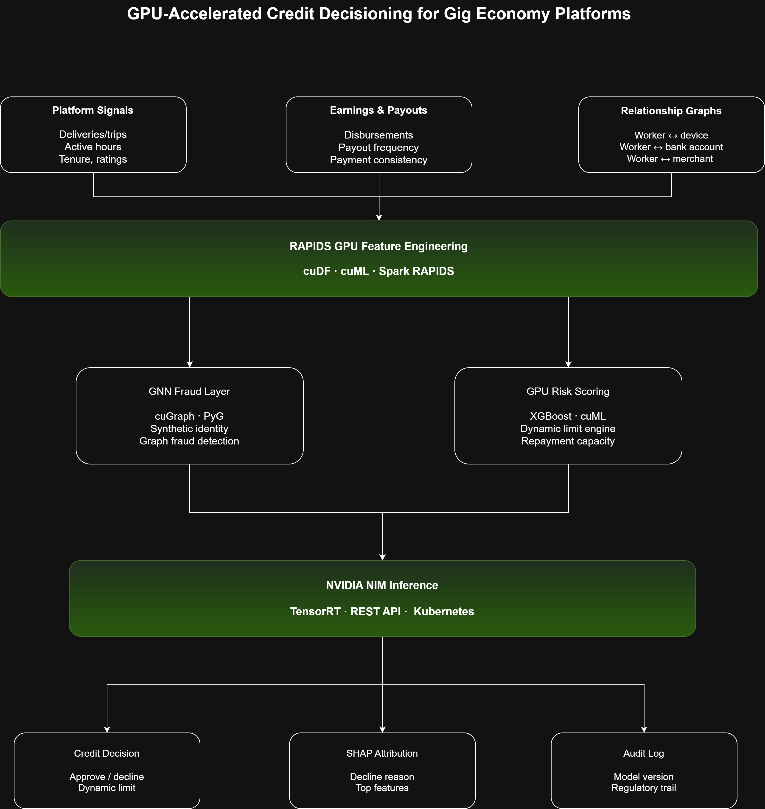

# GPU-Accelerated Credit Decisioning for Gig Economy Platforms

I run credit decisioning infrastructure for gig workers at KarmaLife.

The core problem is simple. Gig workers generate a lot of useful signals such as earnings, deliveries/trips, tenure, payouts, repayment behavior, and device patterns. Traditional credit systems are not designed to make full use of these signals.

At scale, a real-time credit decision is more than a model prediction. It involves feature engineering, fraud detection, credit scoring, policy evaluation, explainability, and audit logging and all of this has to happen within a very small latency budget.

I wanted to explore how an end-to-end credit decisioning pipeline maps onto the NVIDIA accelerated computing stack.
This POC uses RAPIDS for GPU feature engineering, cuGraph for fraud detection, GPU XGBoost for credit scoring, and NVIDIA NIM for inference serving.

The goal is simple to show how a complete credit decision can run on GPU, starting with raw platform signals and ending with an approval or decline, dynamic credit limit, explanation, and audit trail.

The data is synthetic. The architecture and design patterns are based on real production systems.

-----

# The Problem
Gig workers such as delivery partners, rideshare drivers, and platform contractors generate rich behavioral and transaction signals:

* Earnings velocity
* Trip frequency
* Platform tenure
* Fulfillment ratings
* Payment consistency
* Device stability
* Onboarding patterns
* Merchant and account relationships

Traditional credit infrastructure does not use these signals well.

Most systems still depend on fixed salary, bureau history, and stable monthly income. That does not fit many gig workers. They may have thin or no bureau file, variable income, and non-traditional repayment patterns.

The data exists. The bottleneck is compute at scale.

At scale, a credit decisioning pipeline has to process millions of records, detect fraud across relationship graphs, score risk, apply policy rules, and return a decision in milliseconds.

This POC shows how NVIDIA's stack can help across three parts of the pipeline:

* RAPIDS for feature engineering at scale
* cuGraph for relationship-based fraud detection
* NVIDIA NIM for low-latency inference serving
-----

# Architecture

  

-----

# What's in the Notebook

The notebook is organized into six sections and runs end-to-end on a free T4 Colab runtime.

1. Synthetic Data Generation
Generates synthetic gig worker records with:

* earnings history
* deliveries and trips
* active hours
* platform tenure
* payout frequency
* payment consistency
* identity signals
* graph relationship indicators

Fraud is injected at approximately 3% to simulate ring fraud, mule accounts, and synthetic identity patterns.

2. RAPIDS Feature Engineering
Uses cuDF and cuML to build five feature groups:

* earnings velocity
* platform reliability
* repayment capacity
* identity risk
* composite credit signal

Includes a CPU vs GPU benchmark with T4 context. The goal is to show where GPU acceleration starts to matter.

3. GNN Fraud Detection
Uses cuGraph and PyG to model relationships between workers, devices, bank accounts, and merchants.

The fraud layer looks for:

* synthetic identities
* shared device patterns
* mule accounts
* fraud rings
* suspicious communities

Fraud screening runs before credit scoring. Suspicious inputs do not reach the credit model.

4. GPU Credit Scoring
Uses GPU-accelerated XGBoost and cuML for thin-file credit scoring without depending only on bureau data.

The score uses alternative signals such as:

* earnings velocity
* repayment behavior
* platform tenure
* payment consistency
* active work patterns

A simple limit engine applies repayment capacity rules and adjusts the credit limit as the worker builds repayment history on the platform.

5. NVIDIA NIM Inference
Shows a production-style inference flow using NVIDIA NIM.

The notebook demonstrates:

* request payload creation
* model inference
* decision response
* latency measurement

This represents how a real-time credit decisioning API could be served for a bank or lending partner.

6. Explainability and Audit Trail
Generates SHAP-based feature attribution for every decision.

Each response includes:

* approval or decline
* top decision factors
* decline reason
* model version
* timestamp
* audit metadata

The explanation is produced at inference time, not reconstructed later.

-----

# Benchmark
Run on Google Colab A100-SXM4-40GB. Metrics are from actual notebook runs.

| Stage | CPU | GPU (A100) | Speedup |
|---|---:|---:|---:|
| Feature engineering (5M records) | 274 ms | 195 ms | 1.6× |
| GPU XGBoost training (40K records) | — | 466 ms | Measured |

The feature engineering benchmark includes pandas-to-cuDF transfer time. GPU acceleration becomes more valuable when data remains on GPU across feature engineering, graph analytics, model training, and inference.

-----

# Stack
| Component | Purpose |
|---|---|
| cuDF | RAPIDS GPU DataFrame |
| cuML | GPU machine learning |
| cuGraph | Graph analytics |
| PyTorch Geometric (PyG) | Graph neural networks |
| XGBoost (GPU) | Credit scoring |
| NVIDIA NIM | Inference serving |
| TensorRT | Runtime optimization |
| Docker | Containerization |
| Kubernetes | Orchestration |
| Python 3.10+ | Application code |

-----

# Production Notes
The implementation simple, but the architectural patterns are based on production credit decisioning systems.

1. Policy layer separate from ML layer: 
Credit rules are versioned independently from the scoring model. Risk teams can update lending policy without retraining or redeploying the scoring model.

2. Fraud gate before credit gate
GNN fraud screening runs first. Contaminated inputs such as synthetic identities and ring fraud participants are filtered before underwriting.

3. Adverse action at inference time: 
Not generated post-hoc. Every decline produces a regulatory-ready explanation in the same inference call. Audit log written at decision time.

4. Dynamic limits over static origination: 
Credit limit adjusts continuously with earnings velocity. Standard origination models assign a static limit and move on. Static origination limits are often too conservative for variable-income workers whose repayment capacity changes over time.

5. Shared feature definitions across train and serve: 
Training and inference use identical feature generation logic. Reduces training and serving skew. No production system completely eliminates it.

-----

# Run It
Tested on
• Google Colab Free
• Python 3.10
• NVIDIA T4 GPU

git clone https://github.com/buddanaveenkumar-dev/gpu-credit.git
cd gpu-credit

Or open directly in Colab — T4 GPU runtime, no setup required.
https://colab.research.google.com/drive/1-uyzqaztGbVU3lLS2FnFQT8LWaM-nvjy?usp=sharing

# Author
Naveen Budda  
Co-Founder & CTO, KarmaLife  
budda.naveen.kumar@gmail.com  
https://www.linkedin.com/in/naveenbudda
